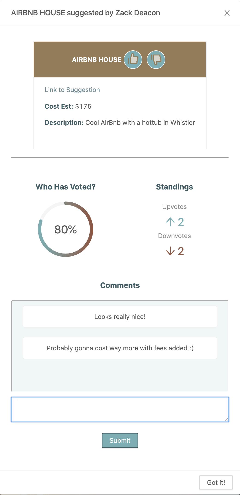
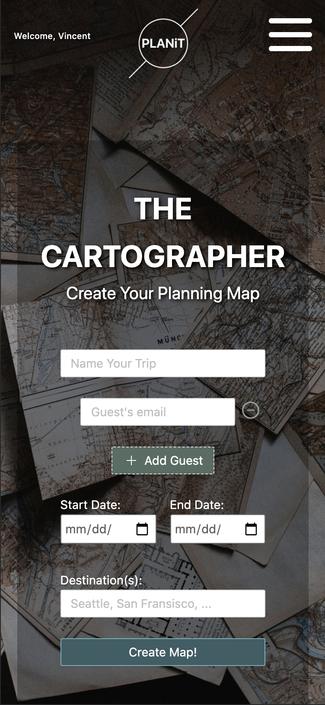
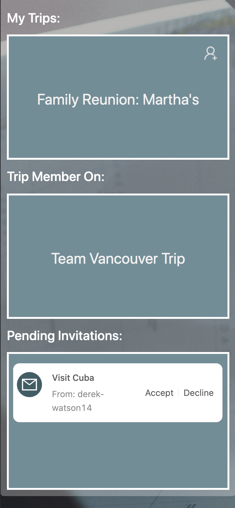

# PLANiT 
  PLANiT is a collaborative travel planning app for groups looking to make the most of their next adventure. Users can create planning boards, or maps as we call them, where an unlimited amount of guests can be invited to suggest or vote on plans within user-customized trip catergories (e.g. Resturants, Accommodation, Hikes, Entertainment etc.) The app makes group consensus clear with visual outputs for voting stats and a print itinerary function that ranks the leading suggestions at any given time. Along with a chat room unique to each map, communicating has never been more accessible and centralized. Whether you are trying coordinate plans with a group or are just having fun dreaming about your next vacation, planning a trip has never been easier or as stress free! PLANiT - connecting our world to your plan!

  ## Specifications
  PLANiT uses a React.js front end, along with MongoDB to create a robust, full MERN application. Tools and packages that were used to make this application possible include socket.io, nodemailer, react-scroll, react-animate-on-scroll, ant-design, axios, and more. The team has plans to integrate more APIs and features to make PLANiT a travel-prep must-have! 

  ## Meet The Team
  Bryce Pingul 
  * GitHub: [Brycetp11](https://github.com/Brycetp11) 
  
  Derek Watson 
  * GitHub: [derek-watson14](https://github.com/derek-watson14) 

  Nicole Remy
  * GitHub: [nicoleremy95](https://github.com/nicoleremy95)

  Vincent Varghese
  * GitHub: [VinAVarghese](https://github.com/VinAVarghese)

  Zack Deacon
  * GitHub: [zackdeacon](https://github.com/zackdeacon)

  ## Contact
  * Email: [teamplanitcartographers@gmail.com](mailto:teamplanitcartographers@gmail.com)
  Feel free to email the team with any suggestions, questions, or comments with the subject line "RE: PLANiT". 
  Thank you and happy travels! 

  ## Links/Images
  [Click For Deployed Application](https://travelplanit.herokuapp.com/)

  
  
  
  
  
  
